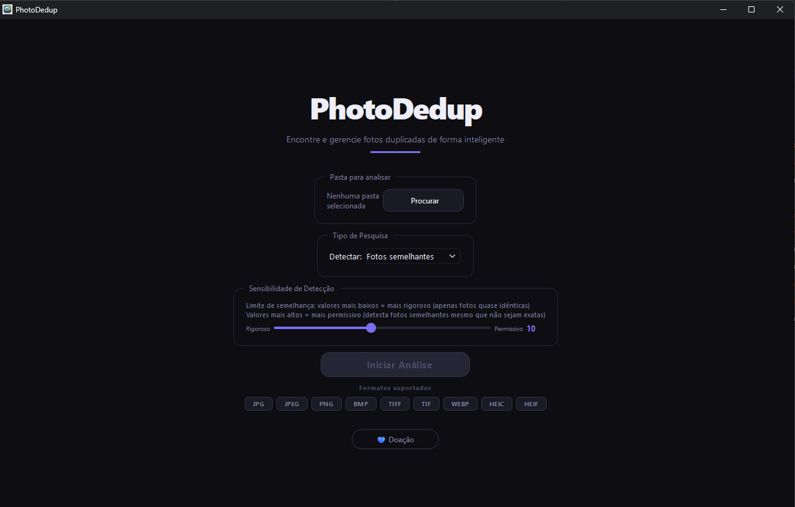
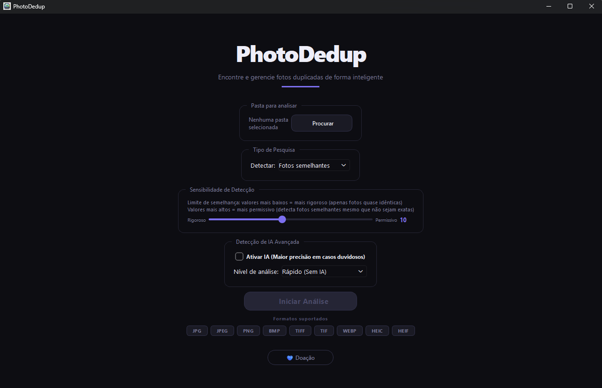
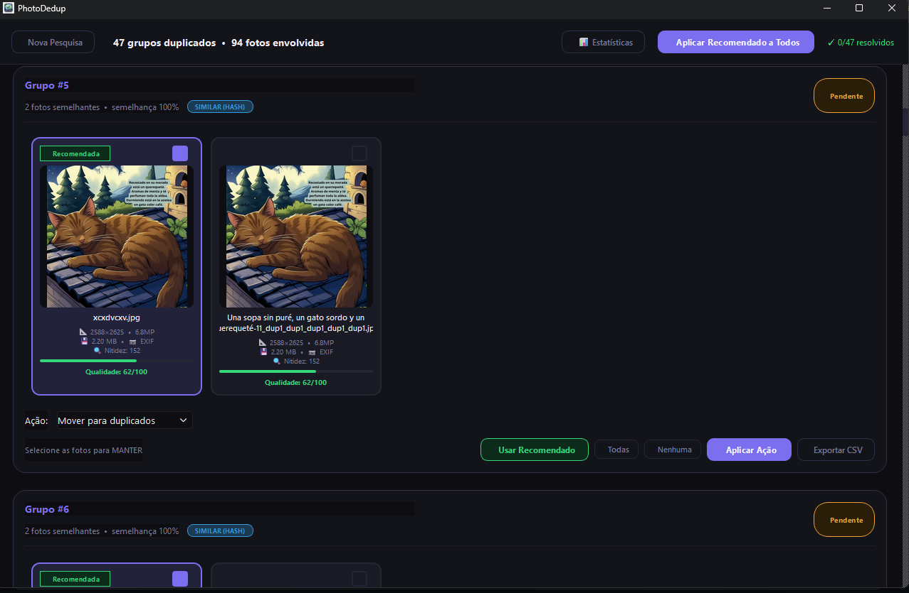

<div align="center">
  
  <h1>PhotoDedup</h1>

  <p align="center">
    <a href="https://www.gnu.org/licenses/gpl-3.0"></a>
    <a href="https://www.python.org/downloads/release/python-3110/"></a>
    <a href="https://www.microsoft.com/windows"></a>
    <a href="https://github.com/wilkinbarban/photo-dedup/releases"></a>
    <a href="#educational-disclaimer--aviso-educativo--aviso-educacional"></a>
  </p>
</div>

---

> **Educational Disclaimer / Aviso Educativo / Aviso Educacional**
>
> This project is developed strictly for educational purposes to demonstrate Python desktop development with PyQt6, image analysis workflows, background processing, and installer automation.
>
> Este proyecto se desarrolla estrictamente con fines educativos para demostrar desarrollo de aplicaciones de escritorio con Python/PyQt6, análisis de imágenes, procesos en segundo plano y automatización de instaladores.
>
> Este projeto é desenvolvido estritamente para fins educacionais para demonstrar desenvolvimento desktop com Python/PyQt6, análise de imagens, processamento em segundo plano e automação de instaladores.

---

## Language / Idioma / Idioma

- [Español](#español)
- [English](#english)
- [Português (Brasil)](#português-brasil)

---

## Español

### Descripción Profesional
PhotoDedup es una aplicación de escritorio para Windows orientada al análisis y gestión de bibliotecas fotográficas con gran volumen de archivos. El proyecto combina análisis hash, comparación visual y, en la edición Full, análisis asistido por IA para ayudarte a detectar duplicados con criterio técnico y con control total sobre qué archivo conservar.

Su objetivo principal es reducir espacio ocupado, mejorar organización y permitir una limpieza segura y auditable de contenido duplicado.

### Capacidades Principales
- Detección de duplicados exactos y similares.
- Integración con metadatos de Google Takeout (`*.json`) para recuperación de información relevante.
- Flujo de revisión por grupos de duplicados para decidir qué imagen conservar.
- Cálculo de estadísticas de ahorro potencial y resultados de análisis.
- Interfaz multilenguaje (ES / EN / PT).
- Eliminación segura hacia Papelera del sistema.

### Versiones Ejecutables (Full vs Lite)

| Variante | Archivo | IA | UI | Caso de uso recomendado |
|---|---|---|---|---|
| Full | `PhotoDedup-full.exe` | Disponible (si runtime IA está presente) | Muestra controles IA | Usuarios que quieren máxima precisión con soporte IA |
| Lite | `PhotoDedup-lite.exe` | No disponible | Oculta controles IA automáticamente | Usuarios que priorizan menor peso, arranque rápido y flujo hash/visual |

### Capturas de Pantalla

**Interfaz Lite (`Captura_1.png`)**



**Interfaz Full (`Captura_2.png`)**



**Selección de imagen a conservar en duplicados (`Captura_3.png`)**



### Descarga de EXE para Windows
Releases oficiales:

https://github.com/wilkinbarban/photo-dedup/releases/latest

Artefactos publicados:
- `PhotoDedup-full.exe`
- `PhotoDedup-lite.exe`

No se publican ZIP como artefacto principal en el flujo actual.

### Instalación con un Clic (PowerShell)

**Opción A: Instalador estándar**
```powershell
powershell -ExecutionPolicy Bypass -Command "iwr -UseBasicParsing https://raw.githubusercontent.com/wilkinbarban/photo-dedup/main/install.ps1 | iex"
```

**Opción B: Instalador seguro (recomendado)**
```powershell
powershell -ExecutionPolicy Bypass -Command "iwr -UseBasicParsing https://raw.githubusercontent.com/wilkinbarban/photo-dedup/main/install_secure.ps1 | iex"
```

### Flujo Técnico de Instaladores
- `install_secure.ps1`:
  - Descarga el repositorio por HTTPS/TLS.
  - Valida descarga y estructura extraída.
  - Actualiza instalación local preservando `.venv`.
  - Delega ejecución en `install.ps1` local.
- `install.ps1`:
  - Verifica raíz de proyecto o activa modo bootstrap.
  - Busca Python compatible (`>=3.8,<3.14`, recomendado 3.11).
  - Crea/reutiliza entorno virtual `.venv`.
  - Instala dependencias y lanza la aplicación.

### Instalación Manual
1. Clona o descarga este repositorio.
2. Ejecuta `install_dependencies.bat` o instala con `pip install -r requirements.txt`.
3. Ejecuta `python src/main/photo_dedup.py`.

---

## English

### Professional Overview
PhotoDedup is a Windows desktop application designed for high-volume photo library analysis and cleanup. It combines hash-based detection, visual similarity matching, and (in the Full edition) AI-assisted comparison to help users identify duplicates while keeping full control over which file to preserve.

The main goal is to reduce storage usage, improve media organization, and provide a safe, reviewable duplicate-resolution workflow.

### Core Capabilities
- Exact and similar duplicate detection.
- Google Takeout JSON (`*.json`) metadata integration.
- Group-based review flow to choose the best file to keep.
- Analysis summaries and recoverable-space statistics.
- Multilingual UI (ES / EN / PT).
- Safe delete workflow to Recycle Bin.

### Executable Editions (Full vs Lite)

| Edition | File | AI | UI behavior | Recommended use |
|---|---|---|---|---|
| Full | `PhotoDedup-full.exe` | Available (when AI runtime exists) | AI controls visible | Users who need highest detection depth with AI support |
| Lite | `PhotoDedup-lite.exe` | Not available | AI controls hidden automatically | Users prioritizing smaller binary size and hash/visual flow |

### Screenshots

**Lite interface (`Captura_1.png`)**


**Full interface (`Captura_2.png`)**


**Duplicate resolution: choose which image to keep (`Captura_3.png`)**


### Windows EXE Download
Official releases:

https://github.com/wilkinbarban/photo-dedup/releases/latest

Published artifacts:
- `PhotoDedup-full.exe`
- `PhotoDedup-lite.exe`

ZIP bundles are not part of the current primary release artifact policy.

### One-Click Installation (PowerShell)

**Option A: Standard installer**
```powershell
powershell -ExecutionPolicy Bypass -Command "iwr -UseBasicParsing https://raw.githubusercontent.com/wilkinbarban/photo-dedup/main/install.ps1 | iex"
```

**Option B: Secure installer (recommended)**
```powershell
powershell -ExecutionPolicy Bypass -Command "iwr -UseBasicParsing https://raw.githubusercontent.com/wilkinbarban/photo-dedup/main/install_secure.ps1 | iex"
```

### Installer Technical Flow
- `install_secure.ps1`:
  - Downloads repository via HTTPS/TLS.
  - Validates downloaded archive and extracted structure.
  - Updates local installation while preserving `.venv`.
  - Delegates to local `install.ps1`.
- `install.ps1`:
  - Validates project-root context or enters bootstrap mode.
  - Detects compatible Python (`>=3.8,<3.14`, preferred 3.11).
  - Creates/reuses `.venv`.
  - Installs dependencies and launches application.

### Manual Installation
1. Clone or download repository.
2. Run `install_dependencies.bat` or `pip install -r requirements.txt`.
3. Run `python src/main/photo_dedup.py`.

---

## Português (Brasil)

### Descrição Profissional
PhotoDedup é um aplicativo desktop para Windows voltado para análise e limpeza de bibliotecas de fotos com grande volume de arquivos. O projeto combina detecção por hash, comparação visual e, na edição Full, análise assistida por IA para ajudar na identificação de duplicatas com controle completo sobre qual arquivo manter.

O objetivo é reduzir espaço ocupado, melhorar organização da biblioteca e oferecer um fluxo seguro e auditável de resolução de duplicados.

### Capacidades Principais
- Detecção de duplicatas exatas e similares.
- Integração com metadados do Google Takeout (`*.json`).
- Fluxo por grupos para escolher qual imagem manter.
- Estatísticas de análise e de espaço recuperável.
- Interface multilíngue (ES / EN / PT).
- Exclusão segura para a Lixeira.

### Versões Executáveis (Full vs Lite)

| Versão | Arquivo | IA | Comportamento da UI | Uso recomendado |
|---|---|---|---|---|
| Full | `PhotoDedup-full.exe` | Disponível (quando runtime IA existe) | Controles de IA visíveis | Usuários que precisam de maior profundidade de detecção |
| Lite | `PhotoDedup-lite.exe` | Não disponível | Controles de IA ocultos automaticamente | Usuários que priorizam executável menor e fluxo hash/visual |

### Capturas de Tela

**Interface Lite (`Captura_1.png`)**


**Interface Full (`Captura_2.png`)**


**Seleção da imagem a manter entre duplicadas (`Captura_3.png`)**


### Download do EXE para Windows
Releases oficiais:

https://github.com/wilkinbarban/photo-dedup/releases/latest

Artefatos publicados:
- `PhotoDedup-full.exe`
- `PhotoDedup-lite.exe`

Pacotes ZIP não fazem parte da política principal de artefatos no fluxo atual.

### Instalação com Um Clique (PowerShell)

**Opção A: Instalador padrão**
```powershell
powershell -ExecutionPolicy Bypass -Command "iwr -UseBasicParsing https://raw.githubusercontent.com/wilkinbarban/photo-dedup/main/install.ps1 | iex"
```

**Opção B: Instalador seguro (recomendado)**
```powershell
powershell -ExecutionPolicy Bypass -Command "iwr -UseBasicParsing https://raw.githubusercontent.com/wilkinbarban/photo-dedup/main/install_secure.ps1 | iex"
```

### Fluxo Técnico dos Instaladores
- `install_secure.ps1`:
  - Faz download do repositório via HTTPS/TLS.
  - Valida arquivo baixado e estrutura extraída.
  - Atualiza instalação local preservando `.venv`.
  - Delega execução ao `install.ps1` local.
- `install.ps1`:
  - Valida contexto de raiz do projeto ou entra em modo bootstrap.
  - Detecta Python compatível (`>=3.8,<3.14`, recomendado 3.11).
  - Cria/reutiliza `.venv`.
  - Instala dependências e inicia a aplicação.

### Instalação Manual
1. Clone ou baixe o repositório.
2. Execute `install_dependencies.bat` ou `pip install -r requirements.txt`.
3. Execute `python src/main/photo_dedup.py`.

---

## Project Structure

| File / Folder | Description |
|---|---|
| `src/main/` | Canonical application entry point and startup flow |
| `src/modules/` | Core logic: analysis, models, state, i18n, logging, utilities |
| `src/interfaces/` | User interface components, dialogs, screens, and theme |
| `scripts/maintenance/` | Maintenance utilities and migration helpers |
| `assets/` | Icons and visual resources (including screenshots) |
| `install_dependencies.bat` | Windows dependency installer |
| `install.ps1` | Standard one-click PowerShell installer |
| `install_secure.ps1` | Secure one-click PowerShell bootstrap installer |
| `scripts/build_windows.ps1` | Windows EXE build script |
| `scripts/build_variants.ps1` | Full/Lite build orchestrator |
| `.github/workflows/build-release-exe.yml` | Tag-based EXE release pipeline |
| `.github/workflows/smoke-test-exe.yml` | Smoke-test pipeline for executable startup |

---

## Educational Disclaimer / Aviso Educativo / Aviso Educacional

This software is provided for educational purposes only. Use of this tool must comply with YouTube Terms of Service, copyright laws, and local regulations. The author is not responsible for third-party misuse.

---

## License

This project is licensed under the GNU General Public License v3.0.
See [LICENSE](LICENSE) for full details.
