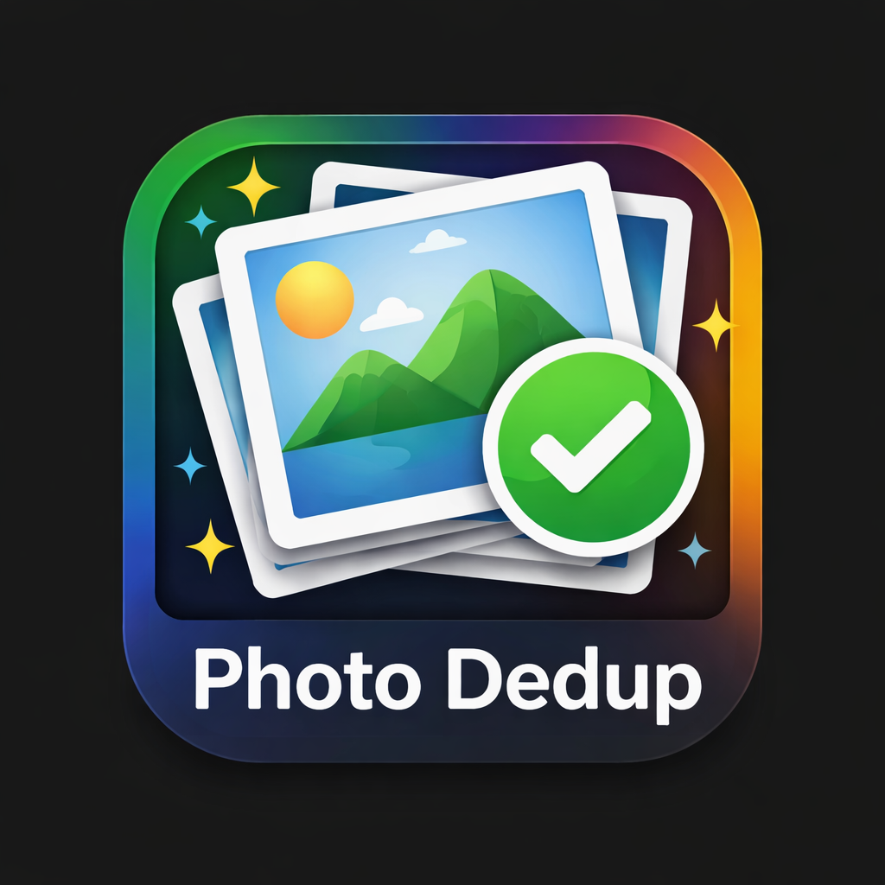

<div align="center">
  
  <h1>PhotoDedup</h1>

  [](https://www.gnu.org/licenses/gpl-3.0)
  [](https://www.python.org/downloads/release/python-3110/)
  [](https://www.microsoft.com/windows)
  [](https://github.com/wilkinbarban/photo-dedup/releases)
  [](#educational-disclaimer--aviso-educativo--aviso-educacional)
</div>

---

> **Educational Disclaimer / Aviso Educativo / Aviso Educacional**
>
> This project is developed strictly for educational purposes to demonstrate Python desktop development with PyQt6, image analysis workflows, background processing, and installer automation.
>
> Este proyecto se desarrolla estrictamente con fines educativos para demostrar desarrollo de aplicaciones de escritorio con Python/PyQt6, analisis de imagenes, procesos en segundo plano y automatizacion de instaladores.
>
> Este projeto e desenvolvido estritamente para fins educacionais para demonstrar desenvolvimento desktop com Python/PyQt6, analise de imagens, processamento em segundo plano e automacao de instaladores.

---

## Language / Idioma / Idioma

- [Español](#español)
- [English](#english)
- [Português (Brasil)](#português-brasil)

---

## Español

### Descripción
PhotoDedup es una aplicación de escritorio para Windows creada con Python y PyQt6 para encontrar fotos duplicadas y organizar medios automáticamente. Detecta duplicados exactos y similares, integra archivos JSON de Google Takeout para restaurar metadatos EXIF y ordena tu biblioteca.

### Características
- Detección de duplicados exactos y visualmente similares.
- Integración con Google Takeout (`*.json`) para restaurar EXIF.
- Organización automática por fecha en estructura `AAAA/MM`.
- Visor de logs en tiempo real.
- Interfaz multilenguaje: Español, English y Português (Brasil).
- Borrado seguro (Papelera del sistema).

### Descargar EXE de Windows
Si prefieres evitar la consola, descarga el ejecutable precompilado desde Releases:

https://github.com/wilkinbarban/photo-dedup/releases/latest

Descarga directamente una de estas variantes:

- `PhotoDedup-full.exe` (incluye opciones de IA si las dependencias están disponibles)
- `PhotoDedup-lite.exe` (sin IA; interfaz simplificada sin controles de IA)

No se publican archivos ZIP: los artefactos oficiales son EXE directos.

### Instalación con un solo comando (PowerShell)

**Opción A - Instalación automática estándar:**
```powershell
powershell -ExecutionPolicy Bypass -Command "iwr -UseBasicParsing https://raw.githubusercontent.com/wilkinbarban/photo-dedup/main/install.ps1 | iex"
```

**Opción B - Instalación automática segura (canal estable):**
```powershell
powershell -ExecutionPolicy Bypass -Command "iwr -UseBasicParsing https://raw.githubusercontent.com/wilkinbarban/photo-dedup/main/install_secure.ps1 | iex"
```

`install_secure.ps1` valida la descarga, extrae en carpeta temporal, actualiza la instalación local y delega al instalador local `install.ps1`.

### Flujo actual de instaladores (1 clic)
- `install_secure.ps1`: descarga el repositorio por HTTPS/TLS, valida la descarga, instala/actualiza en una carpeta local (preservando `.venv`) y delega en `install.ps1`.
- `install.ps1`: valida entorno local, busca/instala Python compatible (`>=3.8,<3.14`, preferido 3.11), crea/reutiliza `.venv`, instala dependencias y lanza la aplicación.
- Ambos scripts soportan actualización en sitio sin destruir el entorno virtual existente.

### Coherencia visual por variante
- En `PhotoDedup-full.exe`, el bloque de IA aparece normalmente.
- En `PhotoDedup-lite.exe`, el bloque de IA se oculta automáticamente para evitar opciones no disponibles.

### Instalación manual
1. Clona o descarga este repositorio.
2. Ejecuta `install_dependencies.bat` o instala manualmente con `pip install -r requirements.txt`.
3. Ejecuta `python src/main/photo_dedup.py`.

---

## English

### Description
PhotoDedup is a Windows desktop application built with Python and PyQt6 to find duplicate photos and organize media automatically. It detects exact and visual duplicates, integrates Google Takeout JSON files to restore EXIF metadata, and structures your library.

### Features
- Exact and visual duplicate detection.
- Google Takeout (`*.json`) integration for EXIF restoration.
- Automatic date-based media organization (`YYYY/MM`).
- Real-time log viewer.
- Multilingual UI: Español, English, and Português (Brasil).
- Safe deletion to Recycle Bin.

### Download Windows EXE
If you prefer not to use the console, download the prebuilt executable from Releases:

https://github.com/wilkinbarban/photo-dedup/releases/latest

Download one of these direct executables:

- `PhotoDedup-full.exe` (AI options available when AI dependencies exist)
- `PhotoDedup-lite.exe` (no AI; UI hides AI controls automatically)

ZIP artifacts are not published; official release assets are direct EXE files.

### One-command install (PowerShell)

**Option A - Standard automatic install:**
```powershell
powershell -ExecutionPolicy Bypass -Command "iwr -UseBasicParsing https://raw.githubusercontent.com/wilkinbarban/photo-dedup/main/install.ps1 | iex"
```

**Option B - Secure automatic install (stable channel):**
```powershell
powershell -ExecutionPolicy Bypass -Command "iwr -UseBasicParsing https://raw.githubusercontent.com/wilkinbarban/photo-dedup/main/install_secure.ps1 | iex"
```

`install_secure.ps1` validates download integrity, extracts to a temp folder, updates local install (preserving `.venv`), and delegates execution to local `install.ps1`.

### Current one-click installer behavior
- `install_secure.ps1`: secure remote bootstrap (HTTPS/TLS), repository download/update, then delegation to local installer.
- `install.ps1`: local setup and launch flow with Python compatibility check (`>=3.8,<3.14`, preferred 3.11), `.venv` create/reuse, dependency install, and app launch.
- Existing local installation is updated in place while keeping `.venv`.

### Full vs Lite UI coherence
- In `PhotoDedup-full.exe`, AI controls are shown as usual.
- In `PhotoDedup-lite.exe`, AI controls are hidden when AI runtime is unavailable.

### Manual install
1. Clone or download this repository.
2. Run `install_dependencies.bat` or install manually with `pip install -r requirements.txt`.
3. Run `python src/main/photo_dedup.py`.

---

## Português (Brasil)

### Descrição
PhotoDedup e um aplicativo desktop para Windows, desenvolvido com Python e PyQt6, para localizar fotos duplicadas e organizar midias automaticamente. Detecta duplicatas exatas e visuais, integra JSON do Google Takeout para restaurar metadados EXIF e estrutura a biblioteca.

### Recursos
- Deteccao de duplicatas exatas e visuais.
- Integracao com Google Takeout (`*.json`) para restauracao de EXIF.
- Organizacao automatica por data (`AAAA/MM`).
- Visualizador de logs em tempo real.
- Interface multilíngue: Español, English e Português (Brasil).
- Exclusao segura para a Lixeira.

### Download do EXE para Windows
Se preferir nao usar console, baixe o executavel precompilado em Releases:

https://github.com/wilkinbarban/photo-dedup/releases/latest

Baixe diretamente uma das variantes:

- `PhotoDedup-full.exe` (mostra opcoes de IA quando as dependencias estao disponiveis)
- `PhotoDedup-lite.exe` (sem IA; interface oculta os controles de IA)

Nao publicamos arquivos ZIP: os artefatos oficiais sao EXE diretos.

### Instalacao com um unico comando (PowerShell)

**Opcao A - Instalacao automatica padrao:**
```powershell
powershell -ExecutionPolicy Bypass -Command "iwr -UseBasicParsing https://raw.githubusercontent.com/wilkinbarban/photo-dedup/main/install.ps1 | iex"
```

**Opcao B - Instalacao automatica segura (canal estavel):**
```powershell
powershell -ExecutionPolicy Bypass -Command "iwr -UseBasicParsing https://raw.githubusercontent.com/wilkinbarban/photo-dedup/main/install_secure.ps1 | iex"
```

`install_secure.ps1` valida download, extrai em pasta temporaria, atualiza instalacao local e delega para o instalador local `install.ps1`.

### Fluxo atual dos instaladores (1 clique)
- `install_secure.ps1`: bootstrap remoto seguro (HTTPS/TLS), download/atualizacao do repositorio e delegacao para o instalador local.
- `install.ps1`: fluxo local de setup e execucao com verificacao de Python compativel (`>=3.8,<3.14`, preferido 3.11), criacao/reuso de `.venv`, instalacao de dependencias e inicializacao do app.
- Instalacoes existentes sao atualizadas no local preservando `.venv`.

### Coerencia visual full vs lite
- No `PhotoDedup-full.exe`, os controles de IA aparecem normalmente.
- No `PhotoDedup-lite.exe`, os controles de IA ficam ocultos quando o runtime de IA nao esta disponivel.

### Instalacao manual
1. Clone ou baixe este repositorio.
2. Execute `install_dependencies.bat` ou instale manualmente com `pip install -r requirements.txt`.
3. Execute `python src/main/photo_dedup.py`.

---

## Project Structure

| File / Folder | Description |
|---|---|
| `src/main/` | Canonical application entry point and startup flow |
| `src/modules/` | Core logic: analysis, models, state, i18n, logging, utilities |
| `src/interfaces/` | User interface components, dialogs, screens, and theme |
| `scripts/maintenance/` | Migration and text-update maintenance helpers |
| `assets/` | Icons and visual resources |
| `install_dependencies.bat` | Windows dependency installer |
| `install.ps1` | Standard PowerShell installer |
| `install_secure.ps1` | Secure installer script (repository source) |
| `scripts/build_windows.ps1` | Builds and packages Windows EXE |
| `.github/workflows/build-release-exe.yml` | Builds and uploads release assets |
| `.github/workflows/smoke-test-exe.yml` | Smoke-test for EXE startup/shutdown |

---

## Educational Disclaimer / Aviso Educativo / Aviso Educacional

This software is provided for educational purposes only. Use of this tool must comply with YouTube Terms of Service, copyright laws, and local regulations. The author is not responsible for third-party misuse.

---

## License

This project is licensed under the GNU General Public License v3.0.
See [LICENSE](LICENSE) for full details.

