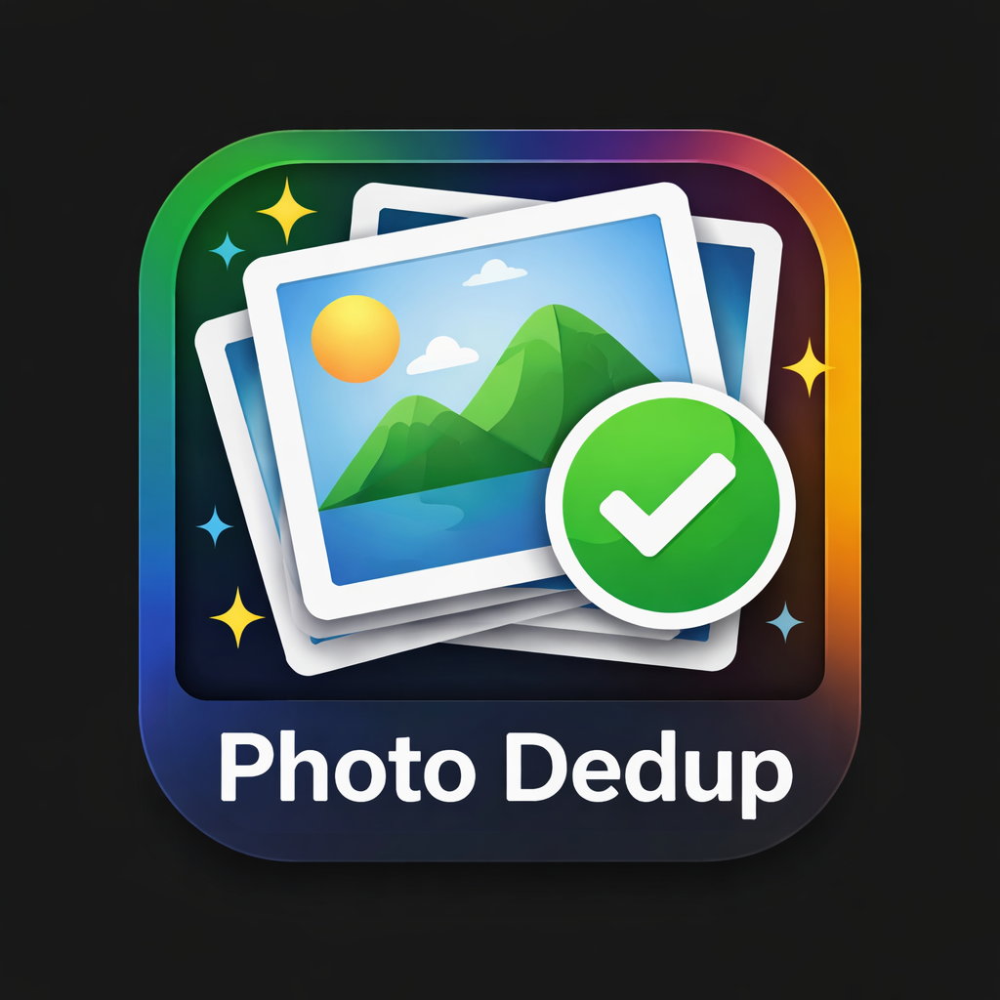
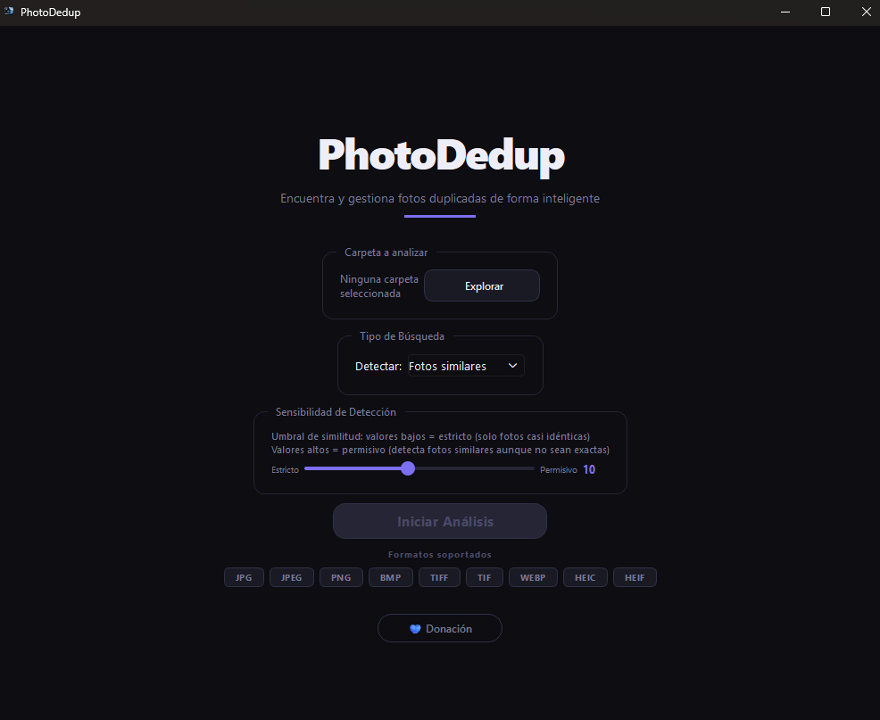
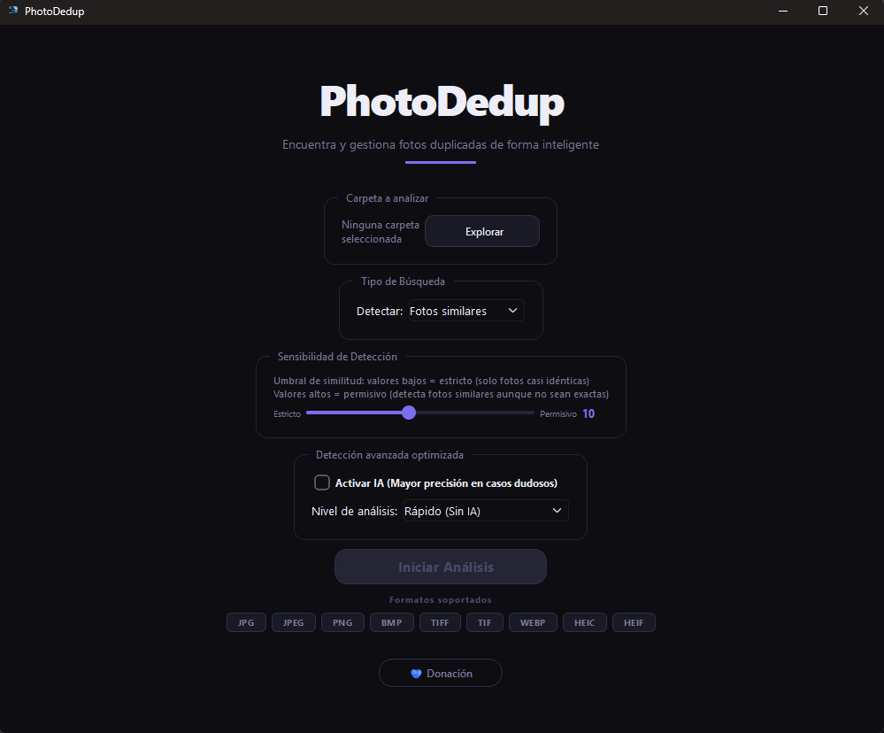
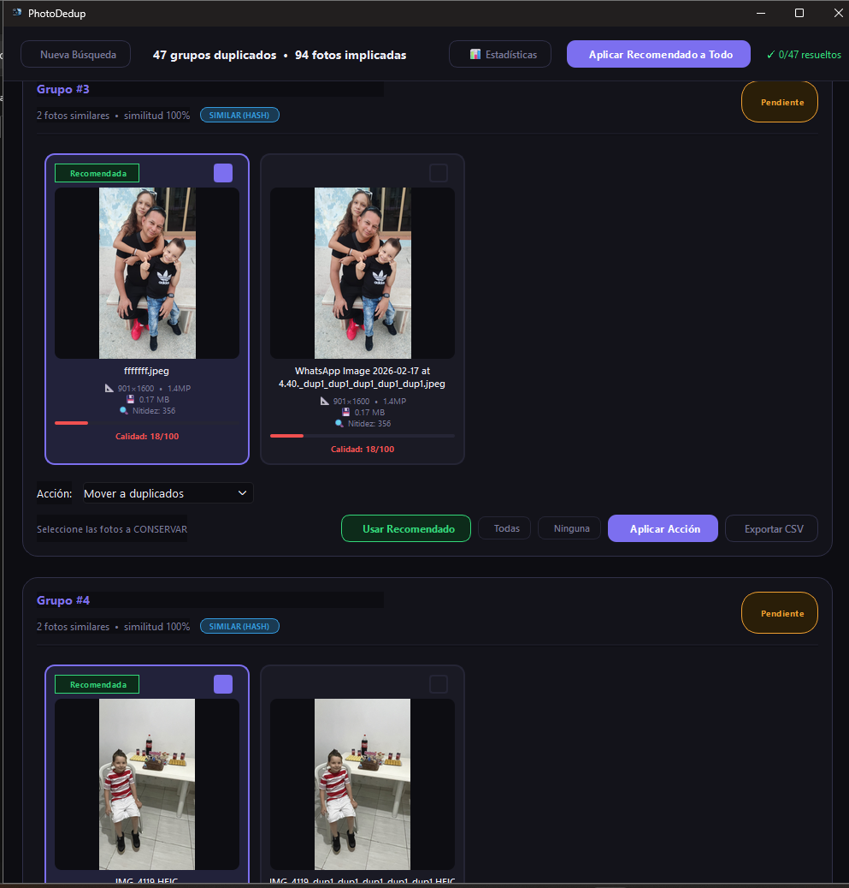

<div align="center">
  
  <h1>PhotoDedup</h1>

  <p align="center">
    <a href="https://www.gnu.org/licenses/gpl-3.0"></a>
    <a href="https://www.python.org/downloads/"></a>
    <a href="https://www.microsoft.com/windows"></a>
    <a href="https://github.com/wilkinbarban/photo-dedup/releases"></a>
    <a href="#educational-disclaimer--aviso-educativo--aviso-educacional"></a>
  </p>
</div>

PhotoDedup is a Windows desktop application for finding, reviewing, and safely resolving duplicate photo groups. It combines exact matching, perceptual similarity, optional AI-assisted comparison in the Full edition, Google Takeout metadata support, and a review-first PyQt6 interface.

## Language / Idioma / Idioma

- [Español](#espanol)
- [English](#english)
- [Português](#portugues)

## Screenshots / Capturas / Capturas

| Lite interface | Full interface | Duplicate resolution |
|---|---|---|
|  |  |  |

## Espanol

### Que es

PhotoDedup ayuda a limpiar bibliotecas fotograficas grandes sin borrar a ciegas. Primero analiza los archivos, agrupa posibles duplicados y luego te permite decidir visualmente que foto conservar.

### Capacidades

- Deteccion exacta por tamano/hash.
- Deteccion visual por hashes perceptuales.
- Analisis asistido por IA en `PhotoDedup-full.exe`.
- Edicion Lite sin dependencias pesadas de IA.
- Integracion con metadatos de Google Takeout (`*.json`).
- Revision por grupos con foto recomendada.
- Acciones seguras: mover duplicados o enviarlos a la papelera.
- Interfaz en ES / EN / PT.
- Cache local para acelerar analisis posteriores.

### Descarga recomendada

Usa la ultima version publicada:

https://github.com/wilkinbarban/photo-dedup/releases/latest

Artefactos principales:

| Archivo | Uso recomendado |
|---|---|
| `PhotoDedup-lite.exe` | Menor tamano, arranque rapido, flujo hash/visual sin IA. |
| `PhotoDedup-full.exe` | Analisis mas profundo con IA opcional cuando el runtime esta disponible. |

### Instalacion con un solo comando

```powershell
powershell -ExecutionPolicy Bypass -Command "iwr -UseBasicParsing https://raw.githubusercontent.com/wilkinbarban/photo-dedup/main/install.ps1 | iex"
```

`install.ps1` es el instalador unico. Si se ejecuta fuera del proyecto, descarga el repositorio oficial, valida la estructura, instala o actualiza la copia local y luego continua con la instalacion desde esa copia. Si se ejecuta dentro del proyecto, valida Python 3.14.x, prepara `.venv`, instala dependencias y abre PhotoDedup.

Para una copia ya descargada o clonada, ejecuta:

```cmd
Install.bat
```

### Uso local para desarrollo

```cmd
python -m venv .venv
.venv\Scripts\activate
python -m pip install --upgrade pip
pip install -r requirements.txt
python src\main\photo_dedup.py
```

Python compatible: `3.14.x`; recomendado: usar el Python instalado en la PC y disponible en `PATH`.
Las dependencias de `requirements.txt` estan ajustadas para Python 3.14.x, incluyendo PyQt6 6.11, NumPy 2.4, OpenCV 4.13, PyTorch 2.12 y torchvision 0.27.

### Comportamiento ante errores

PhotoDedup intenta degradar de forma controlada:

- Si la IA no esta disponible, la app continua en modo hash/visual.
- Si una miniatura no se puede leer, se muestra un marcador visual neutro.
- Si el cache o la configuracion local estan corruptos, se usan valores seguros y se registra el detalle tecnico.
- Si una accion de mover/eliminar falla en algunos archivos, se informa el detalle por archivo sin ocultar los resultados exitosos.

### SmartScreen en Windows

Los ejecutables actuales no estan firmados con certificado de code signing. Windows puede mostrarlos como aplicacion de editor desconocido. Si confias en el origen oficial de GitHub Releases, puedes abrir manualmente `Mas informacion` y luego `Ejecutar de todas formas`.

## English

### What It Does

PhotoDedup helps clean large photo libraries without blind deletion. It analyzes files, groups likely duplicates, and lets you visually decide which photo to keep.

### Capabilities

- Exact duplicate detection by size/hash.
- Visual similarity detection through perceptual hashes.
- AI-assisted comparison in `PhotoDedup-full.exe`.
- Lite edition without heavyweight AI dependencies.
- Google Takeout metadata integration (`*.json`).
- Group-based duplicate review with a recommended keep choice.
- Safe actions: move duplicates or send them to the recycle bin.
- ES / EN / PT interface.
- Local cache for faster repeated scans.

### Recommended Download

Use the latest official release:

https://github.com/wilkinbarban/photo-dedup/releases/latest

Main artifacts:

| File | Recommended use |
|---|---|
| `PhotoDedup-lite.exe` | Smaller binary, faster startup, hash/visual workflow without AI. |
| `PhotoDedup-full.exe` | Deeper analysis with optional AI support when the runtime is available. |

### One-Command Installation

```powershell
powershell -ExecutionPolicy Bypass -Command "iwr -UseBasicParsing https://raw.githubusercontent.com/wilkinbarban/photo-dedup/main/install.ps1 | iex"
```

`install.ps1` is now the single installer. When executed outside the project, it downloads the official repository, validates the extracted structure, installs or updates the local copy, and continues from that local copy. When executed inside the project, it validates Python 3.14.x, prepares `.venv`, installs dependencies, and opens PhotoDedup.

For an already downloaded or cloned copy, run:

```cmd
Install.bat
```

### Local Development

```cmd
python -m venv .venv
.venv\Scripts\activate
python -m pip install --upgrade pip
pip install -r requirements.txt
python src\main\photo_dedup.py
```

Compatible Python: `3.14.x`; recommended: use the Python installed on the PC and available in `PATH`.
`requirements.txt` is aligned with Python 3.14.x, including PyQt6 6.11, NumPy 2.4, OpenCV 4.13, PyTorch 2.12, and torchvision 0.27.

### Error Behavior

PhotoDedup is designed to degrade gracefully:

- If AI is unavailable, the app continues in hash/visual mode.
- If a thumbnail cannot be read, the UI shows a neutral placeholder.
- If local cache or config files are corrupt, safe defaults are used and the technical detail is logged.
- If moving/deleting fails for some files, the app reports per-file details while preserving successful results.

### Windows SmartScreen

Current executables are not code-signed. Windows may show them as unknown publisher apps. If you trust the official GitHub Releases source, open `More info` and then `Run anyway`.

## Portugues

### O que faz

PhotoDedup ajuda a limpar bibliotecas grandes de fotos sem exclusao cega. Ele analisa arquivos, agrupa duplicatas provaveis e permite decidir visualmente qual foto manter.

### Capacidades

- Deteccao exata por tamanho/hash.
- Deteccao visual por hashes perceptuais.
- Comparacao assistida por IA em `PhotoDedup-full.exe`.
- Edicao Lite sem dependencias pesadas de IA.
- Integracao com metadados do Google Takeout (`*.json`).
- Revisao por grupos com foto recomendada.
- Acoes seguras: mover duplicatas ou enviar para a lixeira.
- Interface ES / EN / PT.
- Cache local para acelerar analises futuras.

### Download recomendado

Use a ultima release oficial:

https://github.com/wilkinbarban/photo-dedup/releases/latest

Artefatos principais:

| Arquivo | Uso recomendado |
|---|---|
| `PhotoDedup-lite.exe` | Binario menor, inicio mais rapido, fluxo hash/visual sem IA. |
| `PhotoDedup-full.exe` | Analise mais profunda com IA opcional quando o runtime esta disponivel. |

### Instalacao com um comando

```powershell
powershell -ExecutionPolicy Bypass -Command "iwr -UseBasicParsing https://raw.githubusercontent.com/wilkinbarban/photo-dedup/main/install.ps1 | iex"
```

`install.ps1` agora e o instalador unico. Quando executado fora do projeto, ele baixa o repositorio oficial, valida a estrutura extraida, instala ou atualiza a copia local e continua a partir dessa copia. Quando executado dentro do projeto, valida Python 3.14.x, prepara `.venv`, instala dependencias e abre o PhotoDedup.

Para uma copia ja baixada ou clonada, execute:

```cmd
Install.bat
```

### Desenvolvimento local

```cmd
python -m venv .venv
.venv\Scripts\activate
python -m pip install --upgrade pip
pip install -r requirements.txt
python src\main\photo_dedup.py
```

Python compativel: `3.14.x`; recomendado: usar o Python instalado no PC e disponivel no `PATH`.
`requirements.txt` esta alinhado com Python 3.14.x, incluindo PyQt6 6.11, NumPy 2.4, OpenCV 4.13, PyTorch 2.12 e torchvision 0.27.

### Comportamento de erro

PhotoDedup tenta degradar de forma controlada:

- Se a IA nao estiver disponivel, o app continua em modo hash/visual.
- Se uma miniatura nao puder ser lida, a interface mostra um marcador neutro.
- Se cache ou configuracao local estiverem corrompidos, valores seguros sao usados e o detalhe tecnico e registrado.
- Se mover/excluir falhar em alguns arquivos, o app mostra detalhes por arquivo sem ocultar os resultados bem-sucedidos.

### Windows SmartScreen

Os executaveis atuais nao possuem assinatura de codigo. O Windows pode mostra-los como aplicativos de editor desconhecido. Se voce confia na origem oficial do GitHub Releases, abra `Mais informacoes` e depois `Executar assim mesmo`.

## Project Structure

| Path | Purpose |
|---|---|
| `src/main/photo_dedup.py` | Canonical PyQt6 entry point. |
| `src/interfaces/` | Main window, screens, reusable widgets, language dialog, and visual theme. |
| `src/modules/services/` | Duplicate analysis, AI model, Takeout handling, and domain models. |
| `src/modules/config/` | i18n, app state, cache, config, and history. |
| `src/modules/utils/` | Logging, asset path resolution, and shared error helpers. |
| `requirements.txt` | Runtime dependencies pinned for Python 3.14.x. |
| `requirements-build.txt` | Build-only dependencies such as PyInstaller. |
| `install.ps1` | Unified one-command installer and launcher for remote or local use. |
| `Install.bat` | Local Windows launcher with the same setup/repair flow as `install.ps1`. |
| `scripts/build_windows.ps1` | Builds one Windows EXE flavor. |
| `scripts/build_variants.ps1` | Builds Full and Lite variants. |
| `.github/workflows/` | Release, build, and smoke-test automation. |

## Local Validation

```cmd
python -m py_compile src\main\photo_dedup.py src\interfaces\language_dialog.py src\interfaces\main_window.py src\interfaces\screens.py src\interfaces\theme.py src\interfaces\widgets.py src\modules\config\i18n.py src\modules\config\state.py src\modules\services\ai_model.py src\modules\services\analyzer.py src\modules\services\models.py src\modules\services\takeout.py src\modules\utils\errors.py src\modules\utils\logger.py src\modules\utils\paths.py
```

Packaging validation:

```powershell
pip install -r requirements-build.txt
.\scripts\build_variants.ps1 -Version local-test -SmokeTest
```

## Educational Disclaimer / Aviso Educativo / Aviso Educacional

This project is provided for educational purposes: PyQt6 desktop UI, image-analysis workflows, background processing, packaging, release automation, and resilient error handling. Use it only with photo libraries you own or are authorized to manage.

## License

PhotoDedup is licensed under the GNU General Public License v3.0. See [LICENSE](LICENSE).
